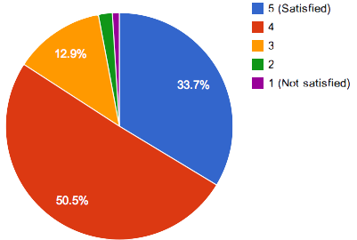

## Call for Proposals

### Submit Your Proposals Here: [http://registrano.com/event/show/coscup-2011?locale=en](http://registrano.com/event/show/coscup-2011?locale=en)

A lot of attention has been on the smart phone market since the introduction of iPhone in 2007. In this highly competitive market sector, phones based on Google's open source Android operating system are leading in the U.S., U.K., France, Germany and Japan as of March 2011 according to an article by the Guardian.
Tablets are the new kids on the block with an explosion of tablet devices predicted in 2011 as Engadget states, "It's been raining tablets here in CES 2011." The introduction of the tablet-only Android 3.0 (Honeycomb) has spurred many analysts to predict that the wave of tablets this year will be dominated by Android-based devices.
The adoption of open source software doesn't stop there. Televisions, set-top boxes, in-car information systems, medical hand-held devices are all being built with open source software such as Google TV and Next TV's popular set-top box in Taiwan. It is clear that the open source paradigm has established a strong foothold in the device space.
With limited computing power and storage space on devices, an internet connection and server/cloud side support are essential. Powered by cloud computing, internet access has taken both mobile and non-mobile devices to a new level by bringing intelligence and content to devices.

### Important Dates

* Submission Deadlines：June 17th, 2011
* Program Schedule Announcement：July 11th, 2011
* Conference Date：August  20th-21th, 2010

### Main Topics

Possible topics include, but not limited to

* **Open Source on Gadgets**:  including boot loader, kernel, library, framework, windowing system, and applications, e.g., Tablets, SmartTV/Internet Connected TV, Set-top Box, Anything you can think of
* **Gadgets and Cloud Computing**:  e.g., HTML5/Web apps on Gadgets, Web Apps for different devices, Program/Job partition between the devices and cloud
* **Open Source on Interesting Boards**:  e.g., Beagleboard/PandaBoard/Gumstix, Arduino
* **OSS in the Ubiquitous Computing Era**:  e.g., IPv6 or not, and how to use IPv6, Context-aware computing with open source software
* **Other FLOSS Issues**:  e.g., legal issues, culture conflict between chip designers and software developers in chip design companies
* **Lightning Talk**: A five-minutes presentation to demonstrate your work or promote an interesting topic. Reservation and on-site application are both accepted.

We plan to have up to 4 parallel tracks with approximates 70 talks. As a reference, last year's program can be found at [here](http://coscup.org/2010/en/program/).

If you are willing to share your knowledge, experience, and/or opinion at COSCUP 2011, please fill in the form at [here](http://registrano.com/event/show/coscup-2011?locale=en) before June 17th, 2010.

The program committee will contact you before July 10th 2011 to inform you whether your submission has been accepted or not.

### About COSCUP

COSCUP is the largest annual open source conference in Taiwan. Founded in 2006, the goal of the conference is to create a friendly, informative, and exciting environment for people interested in open source technologies to make friends, learn new technologies, and inspire each other.

COSCUP was sponsored by 22 international and local companies and organizations in 2010. As a joint conference last year, COSCUP / GNOME.Asia 2010 attracted 80 speakers and nearly 1000 attendees from the U.S., Germany, Japan, Norway, China, and other countries.

The main topic this year is "Gadgets beyond Smartphones". The focus will be on tablets, smartphones, set-top boxes, and the use of cloud computing technologies to create innovative applications for them. We estimate that more than 1,000 people will register for COSCUP this year.

COSCUP is your best choice for finding open source developers, system administrators and users in Taiwan. You will be able to promote your technology, find talent and attract business by speaking at COSCUP. Come join us for this exciting event!

### COSCUP in the past

There were 997 attendees in COSCUP 2010. The seats were fully booked in an hour. According to the registration data, approximately half of attendees were from related industries and half were students. Out of 175 returned post-conference surveys, 85% were satisfied or extremely satisfied with the program, and 99% would recommend COSCUP to their friends.

### Submit Your Proposals Here: [http://registrano.com/event/show/coscup-2011?locale=en](http://registrano.com/event/show/coscup-2011?locale=en)

<h4>COSCUP / GNOME.Asia 2010 Registration</h4>

<h4>Occupations</h4>

<h4>Satisfactoriness</h4>

<h4>Would you like to introduce your friend to join COSCUP?</h4>

