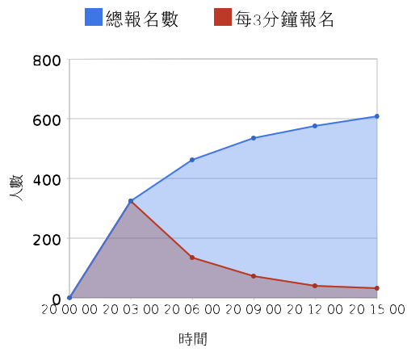
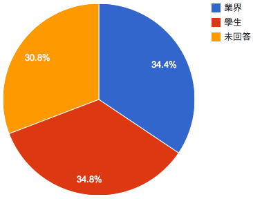
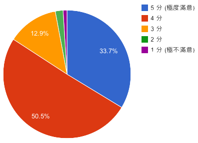
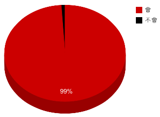

## 演讲征求书

2011 开源人年会现在开始征求讲者。开源人年会 (COSCUP) 是台湾最大的自由软件与开源软件研讨会。本届研讨会将会在 8 月 20、21 日于台北举行，本届大会的主题是「Gadgets beyond Smartphone」。近几年来，市场上以开放源码为基础的 gadget 不管是行动装置还是非行动装置都有越来越多的趋势。以行动装置来说，在智慧型手机市场上由 Google Android 所引领以开放源码为基础的智慧型手机势不可挡。年初 Honeycomb 发表以后，Android 平台在平板电脑方面亦有长足进步，可以想见未来会有更多应用开放源码的行动消费电子产品。在非行动装置方面，以电视和机上盒而言，因应上网需求其实早就从各式各样 proprietary RTOS 往 embedded Linux 移动。去年 Google 在 Google I/O 发表 Google TV 以后，更增添了大家对 Android-based TV 以及其他 Linux 平台的想像空间。在台湾，这几个月来的壹电视『网乐通』风潮，以及后来网乐通释出的 u-boot 与 Linux kernel 原始码也让大家看到开放源码的威力。

### 重要资讯

* 演讲征求
 * 截止日期：2011 年 6 月 17 日
 * 公布议程：2011 年 7 月 11 日

* 研讨会
 * 时间：2011 年 8 月 20 日 ~ 21日
 * 地点：中央研究院人文科学馆国际会议厅

### 征求主题

我们在寻找下列与 Open Source 相关题目的讲者：

* **Open Source Software and Hardware on/for/in Gadgets**：凡是跟 gadget 相关的开源软硬件题目都欢迎，不软不硬也可以。举例来说，软件从 boot loader, kernel, library/framework, window system, programming language 到应用程式都包括在内。在硬件方面，可以用开源软件进去玩、去改，或与 OSS 相关的硬件设备相关议题。硬件类型不限，包括 Embedded system、家用电子、机上盒、电视机、无线基地台等设备，或 GPS、电子书阅读器、车用电子、笔电、手机、平板电脑等具行动能力之装置与相关软件应用，都是合适的题目。
* **Gadget and Cloud Computing**：不管是行动装置还是非行动装置与云端计算都有千丝万缕的关系。行动装置因计算能力以及续航力限制，需要云端运算辅助。而在非行动装置方面，虽然并无续航力问题，但目前许多服务皆是透过网际网路来呈现多样化内容，亦有云端运算需求。举凡可以谈到云和端(terminal device/CPE)的关系的题目，我们都想要。
* **OSS on/in Interesting Boards**："People who are really serious about software should make their own hardware." -- Alan Kay。不管你同不同意这句话，有没有想做自己的硬件。近几年来已经有很多有趣的板子可以玩，例如 Anrduino、BealgeBoad/PandaBoard。
* **OSS in the Ubiquitous Computing Era**：越来越多跑开源软件的 gadget 其实带来不少问题，例如这些 gadget 很多用了 TCP/IP 的网路协定，在 IPv4 即将发完的今日，下一步是什么呢？是 IPv4 + middlebox (e.g. NAT) ，还是 IPv6? 如果走 IPv6 相关的 desktop/laptop/server 该如何配合？
* **Any Other FLOSS Issues**：举凡开源社群运作、经营模式讨论，或是服务、软件使用交流等。FLOSS 的法律相关议题，例如商业应用标准法律作业流程、开源商业模式研究、侵权追踪工程等。开源软件与使用体验相关的修正模式、改善情形与案例分享。程式写作哲学、方法论、编辑器与开发环境、架构特性比较研究、软件工程等能协助程式开发人员写出「好」程式的事情。我们写到的只是一小部份，没写到的也欢迎。
* **闪电秀**：以 5 分钟的时间展示自己的作品或宣传有趣的议题，开放事先和现场报名。

暂定最多同时有四个议程进行，约 70 个演讲场次。

去年 COSCUP 2010 议程请参阅[此处](http://coscup.org/2010/zh-tw/program/)。

如果您想到 COSCUP 2011 分享您的技术、经验或心得，请在 2011 年 6 月 17 日前备齐下列资讯，前往[此处](http://registrano.com/events/coscup-2011)投稿：

* 姓名、昵称或网路ID
* 联系方式（电子邮件、行动电话等）
* 讲题
* 150 字以内的摘要（中英文皆可）
* 简要自我介绍

COSCUP 议程委员会将会在 2011 年 7 月 10 日前通知您是否被接受、以及安排的时段。（如有幸邀您演讲，将另请您提供 800x800 以上之照片电子档一张。）

### 会议简介

COSCUP 是由台湾主要的 Open Source 社群联合主办，包括 Debian Taiwan、KaLug、MozTW、PyTUG、TOSSUG、TWPUG、Ubuntu-TW 等等。本年度研讨会的网站已经上线，而包括本届在内，每年研讨会的网站资料皆可于 http://coscup.org/ 取得。有关 COSCUP 的部落格文章和相片，可以在各大搜寻引擎及相簿网站查询关键字「COSCUP」。

每年都有许多人报名参加 COSCUP，2010 年更是破纪录，在开放报名不到ㄧ小时名额就被一扫而空，并有近千名与会者。2011年，COSCUP 堂堂迈入第六届，我们预期会有超过 1000 人参加，是您发表 Open Source 相关议题，并与众人激荡脑力的绝佳场合。

### 关于您的听众

COSCUP 与会者很多都是在相关社群中现任的工作者及活跃人士，与会者与 Open Source 软件间的关系、以及职业分布等统计，请见图表。听众多有中英文交流能力，若有必要、您的讲题亦可以英文发表。

2010 年与会人数共约 997 人，于晚上八点开放报名后，于极短暂的时间内爆满。报名人次约有半数为业界人士、半数为学生。会后填写问卷的 175 人中，85% 的问卷对于议程给予接近满分的分数，99% 的问卷愿意推荐亲友参加 COSCUP。

<h4>COSCUP / GNOME.Asia 2010 报名速度</h4>

<h4>会众职业</h4>

<h4>议程满意度</h4>

<h4>您是否愿意推荐亲友参加明年的 COSCUP？</h4>

